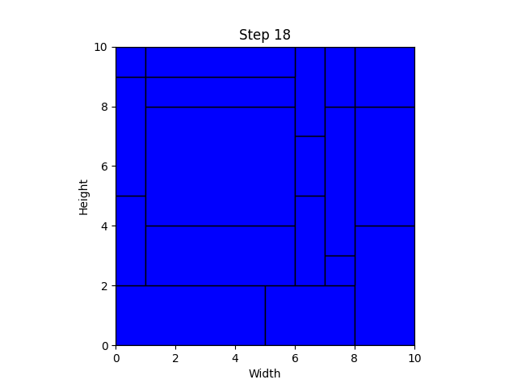
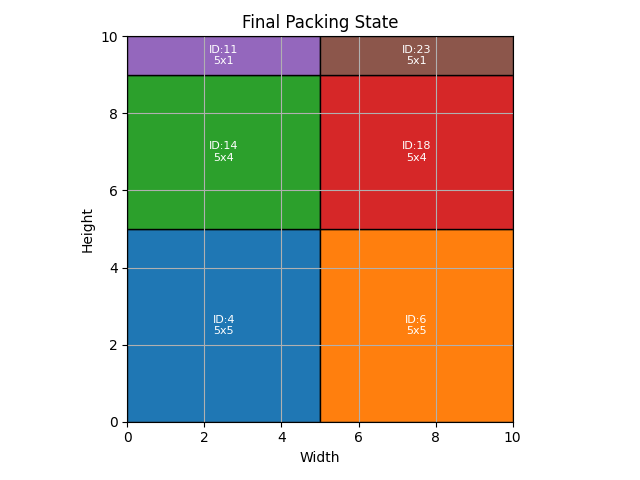
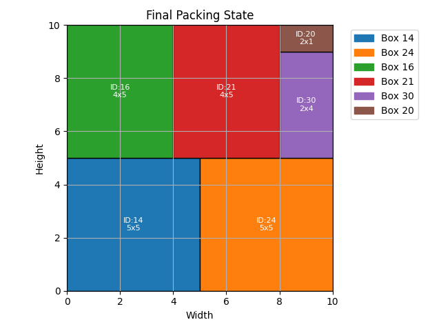

# Bin Packing Simulation

## Overview

This repository contains simulations and implementations of different bin packing algorithms. The goal is to efficiently pack a set of boxes into a container, maximizing space utilization while minimizing the number of boxes used.

We have implemented and compared the following algorithms:

- **Random Packing**
- **First-Fit Decreasing Height (FFDH)**
- **Monte Carlo Tree Search (MCTS)**

## Current Best Scores and Results

### Random Packing

- **Total Boxes Placed:** *18*
- **Total Area Utilized:** *10 x 10*

**Description:**

The Random Packing algorithm selects boxes at random and attempts to place them in the container without any specific strategy. This often leads to inefficient use of space and a lower total area utilization.

---

### First-Fit Decreasing Height (FFDH)

- **Total Boxes Placed:** *6*
- **Total Area Utilized:** *10 X 10*

**Description:**

The FFDH algorithm sorts the boxes in decreasing order based on their area (width × height). It then places each box into the first available space (layer) where it fits, creating new layers as necessary. This approach tends to use the container space more efficiently than random packing.

---

### Monte Carlo Tree Search (MCTS)

- **Total Boxes Placed:** *6*
- **Total Area Utilized:** *10 x 10*
*this is with 25k iterations and a penalty score of 20*

**Description:**

The MCTS algorithm uses a simulation-based search method to explore possible packing configurations. It selects actions that maximize the total packed area while considering penalties for using more boxes. By simulating many iterations, MCTS can find efficient packing solutions that balance space utilization and the number of boxes.

---
